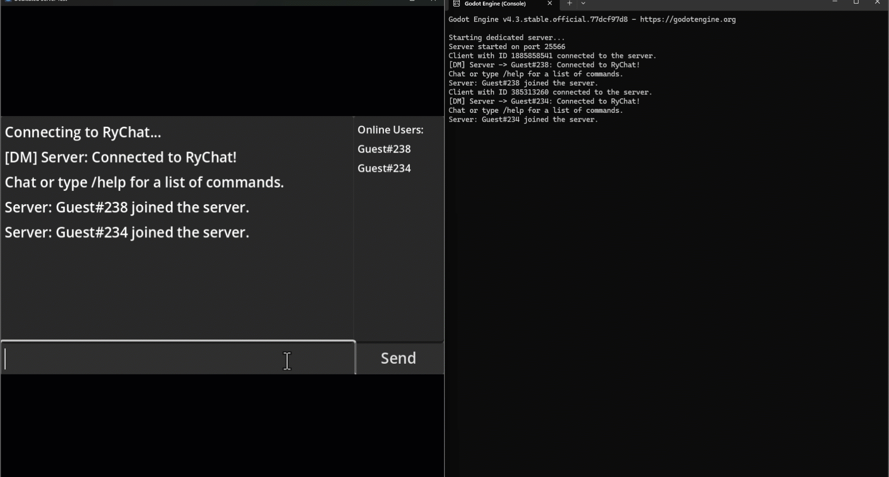

# Multiplayer Chat System (Godot 4.3)

This is a multiplayer chat system built using Godot Engine 4.3 that supports up to 10 clients connecting to a server. The clients can communicate through the chat interface, send direct messages, and use commands such as `/help` and `/list` to interact with the server.

## Features

- Server-client architecture using Godot's ENet networking.
- Up to 100 clients can connect simultaneously.
- Simple chat interface for communication between clients.
- Command system for clients to execute server-side commands.
- Direct message functionality between users.
- Username customization.

## Getting Started

### Prerequisites

- For running executables, you don't need Godot installed.
- The following executables are available in the `Build` folder:
  - `Server.console` (Launch the server from here)
  - `Client` (Launch multiple instances to connect clients to the server)
  - `Server` (Only for running the server without a console, **not recommended** for development purposes).

### Setup Instructions

1. **Download the Repository**  
   Clone the repository or download it as a zip file from GitHub.

   ```bash
   git clone https://github.com/AsePlayer/Online-Chat-Room
   ```

2. **Running the Server**  
   Navigate to the `Builds` folder and run the `Server.console` executable. This will launch the dedicated server.

   **Important**: Always launch the server using `Server.console` instead of `Server` to ensure you can easily shut it down when needed.

   - On **Windows**: Double-click `Server.console.exe`.
   - On **Linux** or **Mac**: Run the executable from the terminal.
   
   Once the server is running, you should see output indicating that the server has started and is listening for client connections.

   

4. **Launching Clients**  
   You can launch multiple clients to connect to the server (up to 100 clients). The client executable is located in the `Builds` folder.

   - On **Windows**: Double-click `Client.exe`.
   - On **Linux** or **Mac**: Run the executable from the terminal.

   Each client will connect to the server at the IP address `127.0.0.1` (localhost) on port `25566`. You can interact with the server and other clients through the chat interface.

   

### Available Commands

Once connected, clients can use the following commands by typing them into the chat window:

- **`/help`**  
  Displays a list of available commands:
  - `/help` - Show this help message
  - `/list` - Show who's online
  - `/dm {username}` - Send a direct message to a specific user
  - `/name {username}` - Change your display name

- **`/list`**  
  Shows a list of all currently connected users.

- **`/dm {username}`**  
  Sends a private message to the user with the specified username. For example, `/dm Player1 Hello!`.

- **`/name {username}`**  
  Changes your current username to the specified one. For example, `/name MyNewName`.

### Stopping the Server

To shut down the server, close the `Server.console` window or stop the process from the terminal. This is why it is important to use the console version of the server, as the regular `Server` executable can be difficult to stop without a visible console.

## File Structure

- **Builds/**  
  This folder contains precompiled versions of the server and client:
  - `Server.console`: Use this to launch the server with an easy-to-shut-down console.
  - `Server`: Runs the server without a console (not recommended for testing).
  - `Client`: Client executable to connect to the server.

- **Scripts**  
  Contains the source code for the server and client (`server.gd` and `ui.gd`) if you want to explore or modify it.

## Usage Notes

- The server can handle up to 100 clients simultaneously. Each client is assigned a default username when they connect, which can be changed using the `/name` command.
- Use `/help` to familiarize yourself with available commands.
- You can send private messages to specific users using the `/dm` command.

## License

This project is licensed under the MIT License - see the [LICENSE](LICENSE) file for details.
